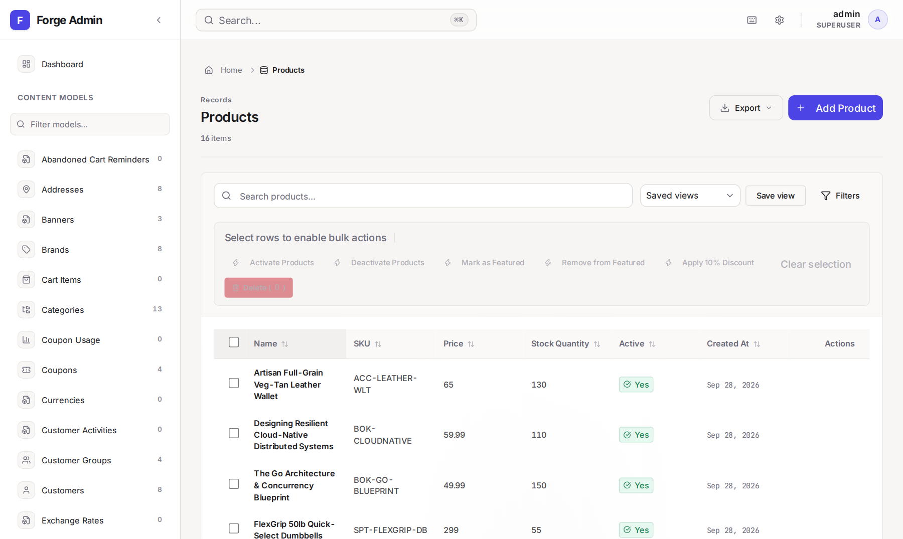

<div align="center">

<picture>
  <source media="(prefers-color-scheme: dark)" srcset=".github/assets/logo-dark.svg">
  
</picture>

# Forge

**The batteries-included web framework for Go.**

Define a model once. Forge generates typed queries, SQL migrations,<br>
a REST API and an admin panel for it.

[](https://github.com/forgego/forge/actions/workflows/test.yml)
[](https://pkg.go.dev/github.com/forgego/forge)
[](LICENSE)

[Documentation](https://forgego.github.io/forge/) ·
[Quickstart](https://forgego.github.io/forge/docs/quickstart/) ·
[Example app](examples/ecommerce/) ·
[Support contract](https://forgego.github.io/forge/docs/status/)

</div>

<picture>
  <source media="(prefers-color-scheme: dark)" srcset=".github/assets/admin-products-dark.png">
  
</picture>

## Why Forge

Go gives you excellent building blocks, and then you wire the same pieces
together for every project: models, queries, migrations, an admin, an API.
Forge takes the approach Django made popular and brings it to Go. You write
the schema, and the rest is generated or configured from it, as ordinary Go
code you can read and change.

- **Schema-first models.** Fields, indexes, relations and hooks live in one Go
  definition per model.
- **Typed queries.** `forge generate` writes a manager and typed field accessors
  for each model, so a misspelled column is a compile error.
- **Migrations from your models.** `forge makemigrations --auto` compares your
  models with the migration history and writes the SQL.
- **Built-in admin.** A React admin with search, filters, saved views, bulk
  actions, change history and per-object permission hooks. With
  `server.stores: database` (the `forge new` default) saved views, change
  history, admin tokens and sessions live in the database, so several
  instances can share them.
- **REST API layer.** ViewSets, serializers, pagination, throttling and an
  OpenAPI document, modelled on Django REST Framework.
- **Secure defaults.** Password hashing, sessions, CSRF protection, secure
  cookies in production and a rate-limited admin login. CORS and request
  rate-limiting middleware are available to add.

> [!NOTE]
> Forge is pre-1.0 (v0.1.x) and its API may still change between minor
> releases. PostgreSQL 15 is the tested database; SQLite is experimental. The
> [support contract](https://forgego.github.io/forge/docs/status/) lists what
> is verified in CI, what is partial, what is excluded, and the stability
> policy.

## A quick look

A model:

```go
package catalog

import "github.com/forgego/forge/schema"

type Product struct {
	schema.BaseSchema
}

func (Product) Fields() []schema.Field {
	return []schema.Field{
		schema.Int64Field("id", schema.Primary(), schema.AutoIncrement()),
		schema.StringField("name", schema.Required(), schema.MaxLength(200)),
		schema.Float64Field("price", schema.Required()),
		schema.BoolField("is_active", schema.Default(true)),
	}
}

func (Product) Meta() schema.Meta {
	return schema.Meta{TableName: "products"}
}
```

A typed query, using the code `forge generate` writes for it:

```go
p := catalog.ProductFieldsInstance

qs, err := catalog.ProductObjects.Filter(orm.And(p.IsActive.Eq(true), p.Price.Lte(150)))
if err != nil {
	return err
}
products, err := qs.OrderBy(p.Price.Desc()).Limit(20).All(ctx)
```

An admin page for it:

```go
admin.Register(&admin.Config[catalog.Product]{
	ListDisplay:  []admin.Field{p.Name, p.Price, p.IsActive},
	SearchFields: []admin.Field{p.Name},
})
```

## Try the example app

The [ecommerce example](examples/ecommerce/) has 57 models across 10 apps,
with the admin and REST API wired up. Docker runs it with PostgreSQL:

```bash
git clone https://github.com/forgego/forge.git
cd forge/examples/ecommerce
docker compose up --build
```

Then open <http://localhost:8020/admin/> and sign in as `admin` / `admin123`.
Those demo credentials are set in the example's `main.go`; do not reuse them.

## Install

Install the `forge` command:

```bash
go install github.com/forgego/forge/cmd/forge@latest
```

Add the framework to an existing module:

```bash
go get github.com/forgego/forge@latest
```

Forge needs Go 1.26 or later.

## Start a project

```bash
forge new myapp --database sqlite --template simple --docker=false
cd myapp
forge add app blog --example
forge generate --models ./app/blog --output ./app/blog
forge makemigrations initial --auto --models ./app/blog
forge migrate up
```

SQLite keeps this example self-contained, but applying migrations to SQLite
is experimental. Use `--database postgres` for anything you deploy, and see the
[deployment guide](https://forgego.github.io/forge/docs/deployment/) before
going to production. The
[quickstart](https://forgego.github.io/forge/docs/quickstart/) covers the next
steps, and `forge --help` lists every command.

## Documentation

- [User documentation](https://forgego.github.io/forge/): models, ORM,
  migrations, admin, REST API, configuration.
- [Design](docs/DESIGN.md), [product requirements](docs/PRD.md) and
  [roadmap](docs/ROADMAP.md) for how Forge is built and where it is going.
- [Contributor docs index](docs/README.md).

## Contributing

Bug reports, questions and pull requests are welcome. Read
[CONTRIBUTING.md](CONTRIBUTING.md) before opening a pull request. To report a
vulnerability, follow [SECURITY.md](SECURITY.md) instead of opening an issue.

## License

Forge is released under the [MIT License](LICENSE).
